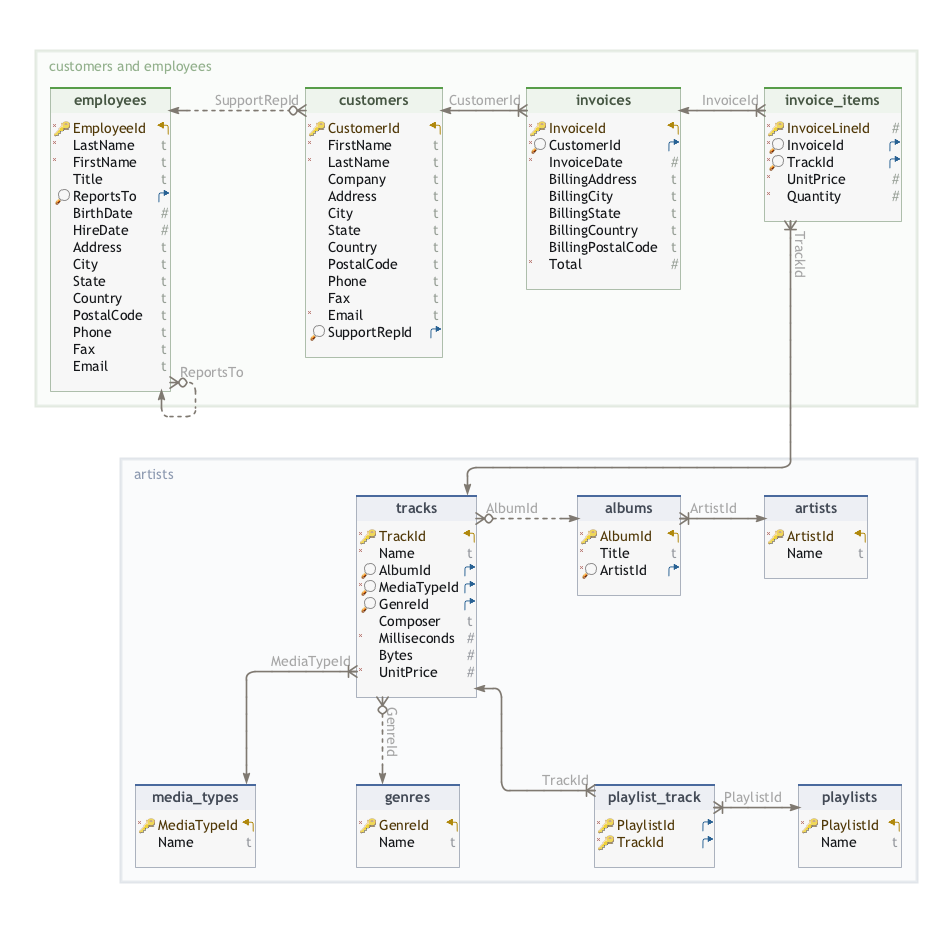

# SQL Tutorial

## General comments

When I first heard about SQL, I honestly thought it was a way of analyzing data similar to what can be done with Pandas dataframes. Looking at the documentation made me realize that I was wrong. So I decided to create a repository, `sql_tutorial`, with exercises to practice querying with SQL. 

I combined the ease of displaying small exercises offered by Jupyter notebook with SQL queries, all applied to a well-known database called Chinook. The latter has a structure displayed in the following diagram.

 

The Chinook database is stored in `Chinook.db`. It is also provided in this tutorial, though it is coming from [SQLite Tutorials](https://www.sqlitetutorial.net/sqlite-sample-database/) and can be downloaded using the following [link](https://www.sqlitetutorial.net/wp-content/uploads/2018/03/chinook.zip).

### Remarks

* The library `sqlite3` has to be installed for any user who don't work on macOS or Mac OS X.
* Jupyter notebooks can be opened by typing the command `jupyter notebook`
in the terminal, such that the program will instantiate a local server at _localhost:8888_, 
and the Jupyter Notebook interface will pop up in a browser window.

Version 1.0.1

## Structure

### basic_commands

This folder contains a notebook (`get_overview_of_database.ipynb`) is meant to get a first look at the Chinook database. 
Here, several `SQLight` commands have been translated into SQL queries that can be applied to the database.

### exercises

As the folder suggests, it contains a notebook (`20_and_more_usual_exercises.ipynb`) meant to solve some exercises. 
The solutions are stored in separate files, such that they are not directly visible.

